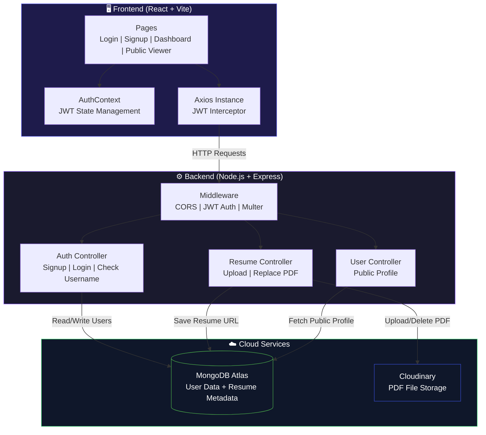
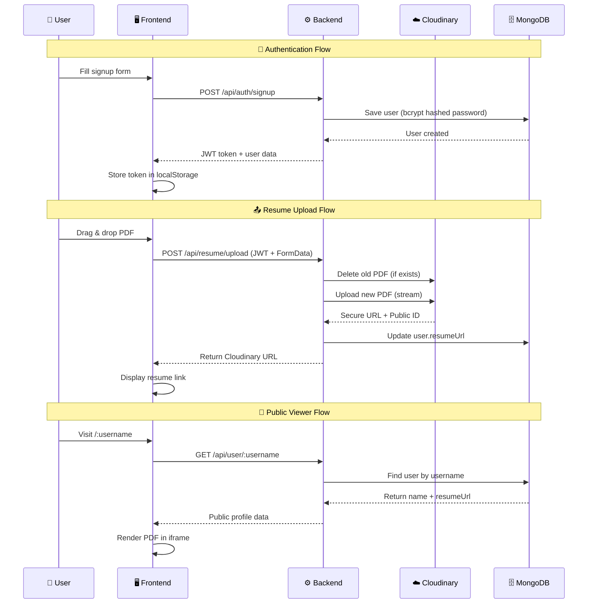

<div align="center">

# 📄 ResumeSync

### One Link. Always Your Latest Resume.

Upload your resume once, get a permanent shareable link — every update reflects instantly. No new links, no broken URLs, no hassle.

[](https://nodejs.org/)
[](https://expressjs.com/)
[](https://react.dev/)
[](https://www.mongodb.com/)
[](https://cloudinary.com/)
[](https://vitejs.dev/)

</div>

---

## 🤔 The Problem

Every time you update your resume, you end up with a **new file** and a **new link**. You've already shared the old link on LinkedIn, job portals, emails, and portfolios — now it's **outdated**. You either:

- Re-share the new link everywhere (tedious)
- Hope recruiters use the latest one (risky)
- Just give up and leave the old version (bad)

**ResumeSync solves this.** Upload your resume, get a **single permanent link**. When you update, the link stays the same — recruiters always see the latest version.

---

## ✅ Existing Quick Solutions

Before building this, here's a reality check — these solutions already exist:

| Solution | How It Works | Limitation |
|----------|-------------|------------|
| 📄 **Google Docs** | Edit anytime, same link updates | Not a PDF, unprofessional for resumes |
| ☁️ **Google Drive** | Use version update, not new file | Requires Google account, clunky viewer |
| 💼 **LinkedIn** | Update resume in Featured section | Limited to LinkedIn ecosystem |
| 🌐 **Portfolio (GitHub Pages / Vercel)** | Replace file, same link | Requires deployment knowledge |

> **So why ResumeSync?**
> This project was built as a **learning exercise** to practice full-stack MERN development — authentication, file uploads, cloud storage, and public API design — all wrapped in a real-world use case.

---

## ✨ Features

- 🔐 **JWT Authentication** — Secure signup, login, logout with bcrypt password hashing
- 📤 **PDF Upload to Cloudinary** — Drag & drop upload, 5MB limit, PDF-only validation
- 🔄 **Auto-Replace** — New upload overwrites old resume; same Cloudinary link persists
- 🔗 **Permanent Public Link** — Each user gets a unique shareable resume URL
- 👀 **Public Resume Viewer** — Embedded PDF viewer + download button, no login required
- 🆔 **Custom Username** — Real-time availability check with URL-safe validation
- 📋 **One-Click Copy** — Copy your resume link to clipboard instantly
- 📱 **Fully Responsive** — Works seamlessly on desktop, tablet, and mobile

---

## 🛠️ Tech Stack

| Layer | Technology |
|-------|-----------|
| **Frontend** | React 19, React Router, Axios, React Hot Toast |
| **Styling** | Vanilla CSS (Glassmorphism, Gradients, Animations) |
| **Build Tool** | Vite |
| **Backend** | Node.js, Express.js |
| **Database** | MongoDB Atlas (Mongoose ODM) |
| **File Storage** | Cloudinary (Raw PDF uploads) |
| **Auth** | JWT + bcrypt |
| **File Handling** | Multer (Memory storage → Cloudinary stream) |

---

## 📁 Project Structure

```
ResumeSync/
├── backend/
│   ├── controllers/
│   │   ├── authController.js       # Signup, Login, Logout, Check Username, Get Me
│   │   ├── resumeController.js     # Upload & replace resume on Cloudinary
│   │   └── userController.js       # Public profile endpoint
│   ├── middleware/
│   │   └── authMiddleware.js       # JWT verification middleware
│   ├── models/
│   │   └── User.js                 # Mongoose user schema
│   ├── routes/
│   │   ├── auth.js                 # Auth routes
│   │   ├── resume.js               # Resume upload route
│   │   └── user.js                 # Public user route
│   ├── utils/
│   │   └── cloudinary.js           # Cloudinary config
│   ├── .env                        # Environment variables
│   ├── server.js                   # Express server entry point
│   └── package.json
│
├── frontend/
│   ├── src/
│   │   ├── api/
│   │   │   └── axios.js            # Axios instance with JWT interceptor
│   │   ├── components/
│   │   │   ├── Navbar.jsx          # Navigation bar
│   │   │   └── Navbar.css
│   │   ├── context/
│   │   │   └── AuthContext.jsx     # Auth state management
│   │   ├── pages/
│   │   │   ├── Login.jsx           # Login page
│   │   │   ├── Signup.jsx          # Signup with username check
│   │   │   ├── Dashboard.jsx       # Upload & manage resume
│   │   │   ├── PublicResume.jsx    # Public PDF viewer
│   │   │   ├── Auth.css            # Auth pages styling
│   │   │   ├── Dashboard.css       # Dashboard styling
│   │   │   └── PublicResume.css    # Viewer styling
│   │   ├── App.jsx                 # Router & route guards
│   │   ├── main.jsx                # Entry point
│   │   └── index.css               # Global styles
│   ├── index.html
│   ├── vite.config.js
│   └── package.json
│
└── README.md
```

---

## 🔌 API Endpoints

| Method | Endpoint | Auth | Description |
|--------|----------|------|-------------|
| `POST` | `/api/auth/signup` | Public | Register a new user |
| `POST` | `/api/auth/login` | Public | Login & receive JWT |
| `POST` | `/api/auth/logout` | Public | Logout (client-side) |
| `GET` | `/api/auth/check-username` | Public | Check username availability |
| `GET` | `/api/auth/me` | 🔒 JWT | Get authenticated user's profile |
| `POST` | `/api/resume/upload` | 🔒 JWT | Upload or replace resume PDF |
| `GET` | `/api/user/:username` | Public | Get public profile & resume URL |

---

## ⚡ Getting Started

### Prerequisites

- [Node.js](https://nodejs.org/) (v18+)
- [MongoDB Atlas](https://www.mongodb.com/atlas) account
- [Cloudinary](https://cloudinary.com/) account

### 1. Clone the Repository

```bash
git clone https://github.com/your-username/ResumeSync.git
cd ResumeSync
```

### 2. Setup Backend

```bash
cd backend
npm install
```

Create a `.env` file in the `backend/` directory:

```env
PORT=5000
MONGO_URI=mongodb+srv://<username>:<password>@cluster.mongodb.net/resumesync
JWT_SECRET=your_super_secret_jwt_key
CLIENT_URL=http://localhost:5173

CLOUDINARY_CLOUD_NAME=your_cloud_name
CLOUDINARY_API_KEY=your_api_key
CLOUDINARY_API_SECRET=your_api_secret
```

Start the backend:

```bash
npm run dev
```

### 3. Setup Frontend

```bash
cd frontend
npm install
npm run dev
```

### 4. Open in Browser

```
http://localhost:5173
```

---

## 🔄 How It Works

```
┌─────────────┐     Signup/Login      ┌─────────────┐
│             │ ──────────────────────▶│             │
│   Frontend  │       JWT Token       │   Backend   │
│   (React)   │ ◀──────────────────── │  (Express)  │
│             │                       │             │
│             │    Upload PDF         │             │       ┌──────────────┐
│             │ ──────────────────────▶│             │──────▶│  Cloudinary  │
│             │    Resume URL         │             │◀──────│  (Storage)   │
│             │ ◀──────────────────── │             │       └──────────────┘
│             │                       │             │
│             │   Save URL + Meta     │             │       ┌──────────────┐
│             │                       │             │──────▶│   MongoDB    │
│             │                       │             │◀──────│   (Atlas)    │
└─────────────┘                       └─────────────┘       └──────────────┘

Public Viewer: /:username → Fetches resume URL → Renders PDF (No login needed)
```

---

## 🏗️ System Overview

### Component Architecture



### Request Flow



---

## 📸 Screenshots

> _Add screenshots of your Login, Dashboard, and Public Viewer pages here._

<!-- 


-->

---

## 🧠 What I Learned

- JWT-based authentication flow (signup → token → protected routes)
- File upload pipeline: Client → Multer (buffer) → Cloudinary (stream)
- Cloudinary resource management (upload, overwrite, delete by public ID)
- React Context API for global auth state
- Route guards (Protected + Guest routes) in React Router
- Real-time input validation with debounced API calls
- CORS configuration between frontend and backend origins

---

## 📝 License

This project is open source and available under the [MIT License](LICENSE).

---

<div align="center">

**Built with ❤️ as a MERN Stack learning project**

</div>
